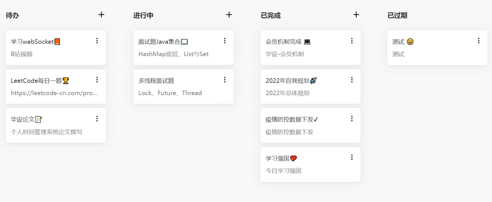

1. # 个人时间管理系统

   #### 项目介绍

   项目分成前台和后台，前台为用户端，后台为后台管理系统。项目稍微粗糙了点，因为主要以学习并整合技术栈为目的做的项目，所以本项目中涉及大量技术，有的技术可以不用的但是还是有用到，哈哈哈。

   觉得还不错的话，帮忙点个` star` 鼓励一下吧，如果有问题的可以加我微信哦！！！

   #### 用户前台

    登录页：
    
    注册和忘记密码：
    
    
    待办看板：
    
    待办列表：
    
    个人日志：
    
    日历看板：
    
    自我规划：
    
    白噪音:
    
    奖惩机制:
    
    
    会员升级:
    
    个人主页:
    
    统计分析：
    
    
    

   #### 系统后台

    后台没啥好看的，就是对前台资源进行管理统计。

   #### 介绍

   前端：后台管理系统采用 [vue-element-admin](https://panjiachen.github.io/vue-element-admin-site/zh/guide/) 后台集成方案进行二次开发。微信小程序采用 [uni-app](https://uniapp.dcloud.io/) 开发框架。

   后端：后台管理模块采用 Alibaba SpringCloud 构建后端微服务，使用 SpringSecurity 做系统安全框架，配合 RBAC 设计模式实现用户的权限管理，使用 Redis 对用户token及字典数据进行缓存；数据库采用 Mysql（5.7） ，使用 [Mybatis-Plus](https://mybatis.plus/) 做数据访问层，Druid 作为数据库连接池。

   短信服务采用腾讯云（唉，阿里的申请了七八次不给通过）。

   使用阿里OSS作为文件存储系统（最开始用的 FastDFS，奈何不想一直开着虚拟机）。

   使用支付宝沙箱。

   #### 安装教程

   1. 开发需要准备相关的 IDE 和  JDK8 开发环境 , 前端开发需要下载  Visual Code，后端开发需要下载 `Eclipse` 或` IDEA`。

   2. 首先需要一台虚拟机，可以使用阿里的也可以本机安装；在虚拟机上我们需要搭建环境：nacos 和安装 Redis 等。（虚拟机中的软件安装可以见软件安装文档）

   3. 短信服务使用腾讯云，需要自己去腾讯云申请签名及模板（比阿里的好申请），在 nacos 中进行配置。 

   4. 文件存储系统使用的是阿里OSS，也可以自己搭建 FastDFS 服务，在 nacos 中进行配置。

   5. 数据库准备，创建一个名称为 `time-manage` 的数据库，把目录下 `time-manage.sql`数据库文件进行导入进去即可。

   6. 后端启动：（需要虚拟机并安装好软件）

      后台管理系统：先启动 gateway 网关之后启动 authorization 授权服务器。之后启动任意服务

   7. 前端启动：

      后台管理系统：在 Visual Code 中打开  `time-admin` 和 `time-portal`, 在控制台输入 npm run install 下载依赖，依赖下载完后，使用命令 npm run dev 运行前端项目。

   8. 务必记得：在登录后台管理系统后，到字典管理模块点击同步缓存的按钮，把字典类型及数据添加到redis缓存中！！！

   #### 技术栈

    

   PS：基于Apache License 2协议开源友好，使用、参考、转载请保留出处，严禁将项目直接打包出售。